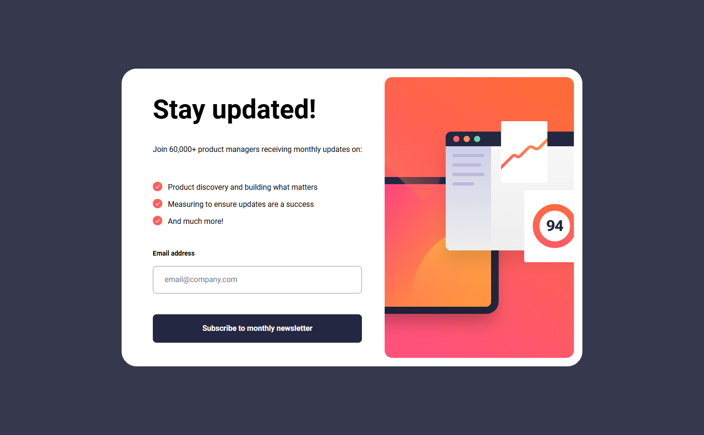
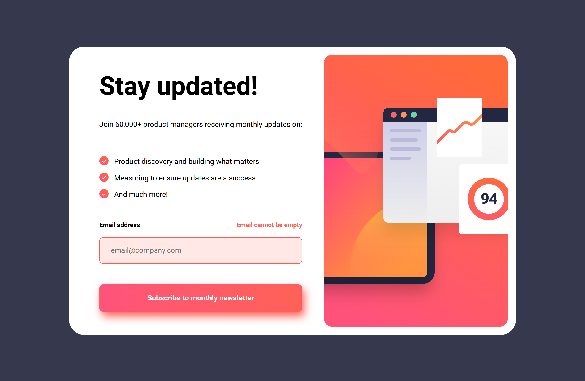
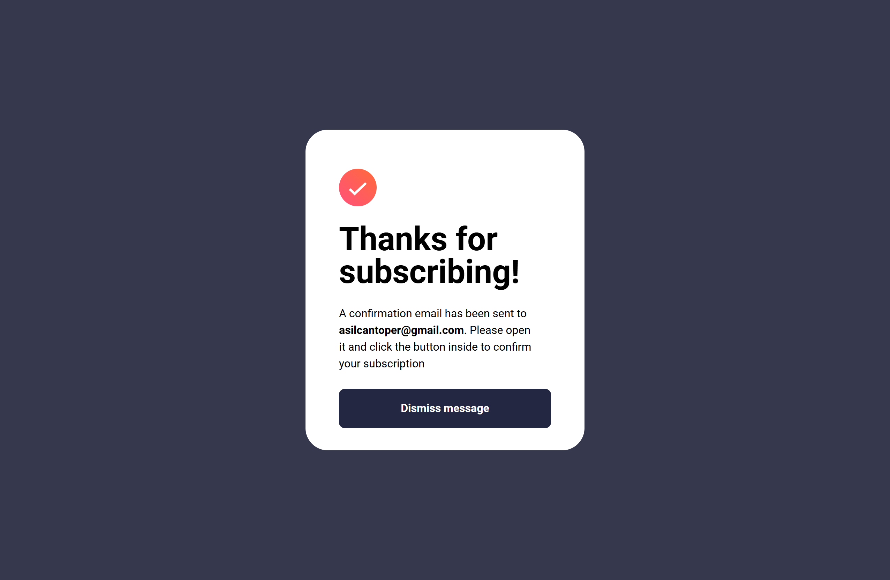

# Frontend Mentor - Newsletter sign-up form with success message

This is a solution to the [Newsletter sign-up form with success message on Frontend Mentor](https://www.frontendmentor.io/challenges/newsletter-signup-form-with-success-message-3FC1AZbNrv). Frontend Mentor challenges help you improve your coding skills by building realistic projects.

## Table of contents

- [Overview](#overview)
  - [The challenge](#the-challenge)
  - [Screenshot](#screenshot)
  - [Links](#links)
- [My process](#my-process)
  - [Built with](#built-with)
  - [What I learned](#what-i-learned)
  - [Accessibility & No-JS Implementation](#accessibility--no-js-implementation)
  - [Useful resources](#useful-resources)
- [Author](#author)

## Overview

### The challenge

Users should be able to:

- Add their email and submit the form
- See a success message with their email after successfully submitting the form
- See form validation messages if:
- The field is left empty
- The email address is not formatted correctly
- View the optimal layout for the interface depending on their device's screen size
- See hover and focus states for all interactive elements on the page

### Screenshot

<table>
  <tr>
    <th>Desktop View</th>
    <th>Mobile View</th>
  </tr>

  <tr>
    <td></td>
    <td rowspan="6"></td>
  </tr>
  <tr>
    <td></td>
  </tr>
  <tr>
    <td></td>
  </tr>
  <tr>
    <td></td>
  </tr>
  <tr>
    <td></td>
  </tr>
  <tr>
    <td></td>
  </tr>
</table>

### Links

[Live Site URL](https://kapteynuniverse.github.io/Intro-component-with-sign-up-form/)

[Solution URL](https://www.frontendmentor.io/solutions/newsletter-sign-up-DwrFqVXIWB)

## My process

### Built with

- Semantic HTML5 markup
- CSS custom properties
- Mobile-first workflow
- Flexbox
- Responsive images using `<picture>`
- Modern CSS features (`clamp`, `text-wrap`, `:focus-visible`)
- Vanilla JavaScript (form validation & UI state handling)

### What I learned

While building this project, I improved my understanding of:

- Structuring forms semantically and accessibly using proper labels and input associations
- Managing UI states (error, success) in a clean and maintainable way with JavaScript
- Using CSS custom properties to create a scalable and reusable design system
- Preventing layout shifts by defining image dimensions
- Writing cleaner, more modular JavaScript by separating validation logic from UI updates
- Improving user experience with real-time validation feedback

### Accessibility & No-JS Implementation

- Used proper `<label>` and `for` attributes for form inputs
- Announced dynamic error messages with `aria-live`
- Used `:focus-visible` to provide better keyboard navigation feedback

### Useful resources

- [MDN - `:focus-visible`](https://developer.mozilla.org/en-US/docs/Web/CSS/:focus-visible) : Improved accessibility by styling focus states only when needed (keyboard users).

- [MDN - aria-live attribute](https://developer.mozilla.org/en-US/docs/Web/Accessibility/ARIA/Reference/Attributes/aria-live) : Helped me understand how to announce dynamic content updates (like validation errors) to screen readers.

- [MDN - noValidate property](https://developer.mozilla.org/en-US/docs/Web/API/HTMLFormElement/noValidate) : Clarified how to disable default browser validation UI and handle validation manually when needed.

- [MDN - Regular expressions](https://developer.mozilla.org/en-US/docs/Web/JavaScript/Guide/Regular_expressions) : Helped me understand email validation patterns and why native validation is often a better choice.

## Author

- Frontend Mentor - [Asilcan Toper](https://www.frontendmentor.io/profile/KapteynUniverse)
